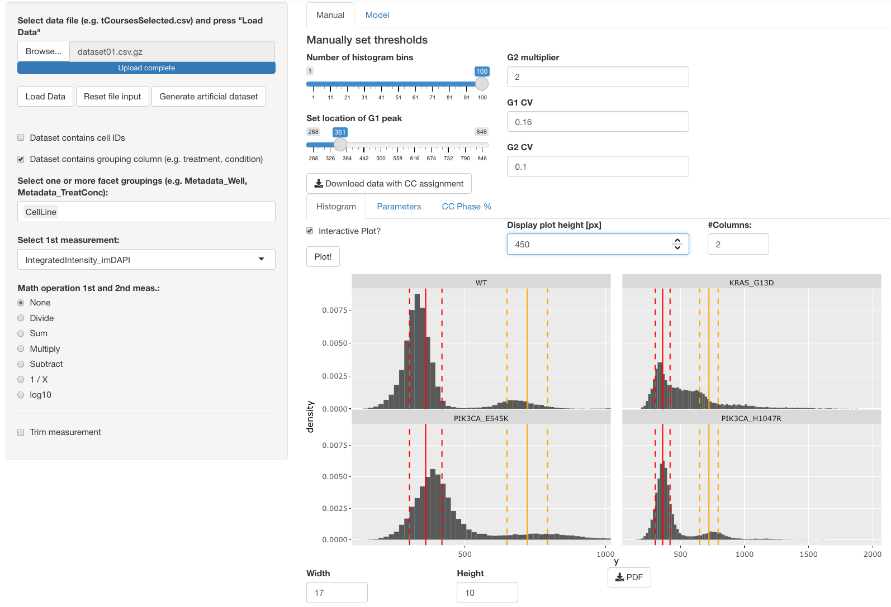

# One-dimensional cell cycle analysis

An interactive web app to identify cell cylce stages in single-cell data from immunofluorscence or flow cytometry.

Use data from single-cell immunofluoerscence imaging such as cells stained with DAPI, HOECHST, PI, and assess cell cycle stage based on the histogram of the DNA content. Available is a *manual mode* to identify G1 and G2/M peaks and their width manually, or *fitting mode* where a simple G1G2S0 model can be fitted to the DNA content histogram.



# Running the app

The app can be run either locally or on a server. The installation process is detailed below.

## Prerequisites

The app requires a modern web browser and a recent R installation. Instructions to install R can be found on the official [R-project website](https://www.r-project.org/). Once R is installed, install `shiny` package by typing: `install.packages("shiny")` in the R console.

The app depends on other packages, which should be installed by typing:

```
install.packages(c("shiny", "shinyjs", 
                   "data.table", 
                   "ggplot2", "plotly", "scales",
                   "minpack.lm", "rlist", "DT"))

```

For new R users, once you have installed R, we recommend to use R from Rstudio. It provides an excellent programming interface and makes it slightly easier to run Shiny apps! Instructions for installation can be found on the [Rstudio website](https://rstudio.com/).

## Installing and starting the app

First, download the latest version of the app directly from [GitHub ](https://github.com/dmattek/cell-cycle-1d) (green button *Clone or download*, download as zip). Unzip the folder and place it in your favourite location.

If you have installed RStudio, click *File -> Open Project*, navigate to the location where you placed the app and open the file `cellcycle.Rproj`. To start the app, open `server.R` or `ui.R` in the Rstudio session, then click the *Run App* button with a green triangle in the upper right corner of the window with code open.

If you did not install Rstudio, or do not wish to use it, you can also start the app directly from your OS's command line with:

```
R -e "shiny::runApp('path-to-application-folder')"
```

In this case, open your web browser and point to the address given by the output of that command.

### Running the app directly from GitHub

If you have already an R installation with `shiny` installed you can also run the two following lines in your R console to get immediately started with a temporary copy of the app:

```
library(shiny)
runGitHub("dmattek/cell-cycle-1d")
```

If you like it, we strongly recommend that you switch to a regular installation! This will make it work offline without the need to download the source code at every start.

# Data format

A minimal dataset requires a single column with a header, e.g.:

```
DAPI
3.45
4.23
2.35
5.43
```

Additional columns can be used to group the data per condition, e.g.:

```
DAPI, Cell_line
3.45, WT
4.23, WT
2.35, Mutant1
5.43, Mutant2
```

An example dataset with DAPI fluorescent intensities from 4 different cell lines, ~20k data points per cell line, can be found in `example-data/dataset01.csv.gz`. Note that files compressed to `gz` and `bz2` formats can be loaded directly into the app without decompression.
